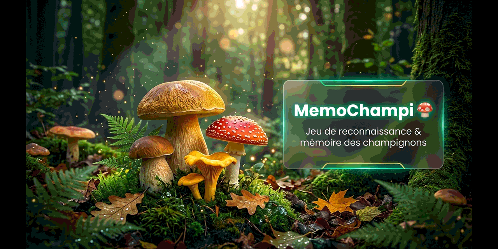

<p align="center">
  
</p>

<p align="center">
  <h1 align="center">🍄 MemoChampi</h1>
  <p align="center"><strong>Jeu de mémoire et de reconnaissance visuelle des champignons des bois</strong></p>
  <p align="center">
    👉 <strong><a href="https://chouteau.github.io/memochampi/">Jouer au jeu en ligne !</a></strong>
  </p>
</p>

*💡 Conçu dans le même esprit que **<a href="https://github.com/chouteau/memofrance">MemoFrance</a>** et **<a href="https://github.com/chouteau/memomonde">MemoMonde</a>**, MemoChampi vous invite dans les sous-bois pour entraîner votre œil, tester vos réflexes et mémoriser les espèces de champignons comestibles et toxiques de nos forêts.*

L'application est entièrement statique, ultra-fluide et fonctionne **100% localement** dans votre navigateur (aucun serveur backend ni base de données requis).

---

## 🚀 Caractéristiques Principales

### 1. Mécanique de Jeu Dynamique (20 Questions par Session)
* **Reconnaissance Visuelle HD** : Chaque question présente une photographie haute résolution d'un champignon dans son milieu naturel.
* **4 Propositions QCM** : Un seul choix est correct, accompagné de 3 distracteurs intelligents sélectionnés selon la famille botanique ou les confusions courantes.
* **Raccourcis Clavier Intuitifs** :
  * Touches `1`, `2`, `3`, `4` pour sélectionner instantanément votre réponse.
  * Touche `Espace` ou `Entrée` pour passer à la question suivante.
  * Touches `Z` ou `F` pour zoomer en plein écran sur la photo.
  * Touche `Échap` pour fermer les fiches et visionneuses.

### 2. Base de Données Mycologique Riche (109 Espèces Illustrées)
* **Photographies Libres de Droit** : Toutes les photos sont issues de **Wikimedia Commons** sous licences libres (Creative Commons CC BY-SA / Domaine Public), téléchargées et optimisées en local.
* **Fiches Mycologiques Éducatives** détaillées :
  * **Comestibilité normalisée** : 🍴 *Excellent comestible*, 🍽️ *Comestible*, ⚠️ *Toxique*, ☠️ *Mortel*, 🪵 *Sans intérêt*.
  * **Morphologie** : Chapeau, lames/tubes/aiguillons, pied (anneau, volve).
  * **Biotope & Saison** : Forêts de feuillus ou conifères, période de récolte.
  * **Risques de confusion** : Alertes indispensables sur les sosies dangereux (ex: *Amanite phalloïde*, *Gyromitre*, *Bolet de Satan*, *Cortinaire des montagnes*).
  * **Anecdotes & Le saviez-vous ?** : Origines historiques et faits fascinants.

### 3. Ergonomie & Expérience Utilisateur
* **Design Glassmorphism Végétal** : Palette immersive aux teintes de sous-bois et d'émeraude, transitions fluides et animations réactives.
* **Double Thème (Sombre / Clair)** : Changement de thème en un clic avec mémorisation dans le `localStorage`.
* **Synthétiseur Audio Web Audio API** : Effets sonores d'ambiance 100% natifs (carillons de validation, buzz d'erreur, fanfare de victoire) sans aucun fichier audio externe à charger.
* **Visionneuse Lightbox Zoom** : Examen minutieux des détails du chapeau, des pores et des lamelles en plein écran.
* **Bilan Final & Révision des Erreurs** :
  * Calcul de la note sur 20 avec badge de rang (*Grand Maître Mycologue*, *Cueilleur Expert*, *Amateur Averti*...).
  * Récapitulatif interactif de l'intégralité des 20 propositions avec ouverture directe de la fiche explicative au clic.
* **Mycothèque Intégrée (Encyclopédie)** : Consultation et recherche de l'ensemble des 109 espèces avec filtres par comestibilité et recherche textuelle en temps réel.

---

## 🛠️ Stack Technique

* **HTML5** : Structure sémantique accessible, balisage SEO & OpenGraph, JSON-LD Schema.org.
* **CSS3** : Variables CSS dynamiques, Glassmorphism moderne, flexbox/grid responsive (Desktop, Tablette, Mobile).
* **JavaScript (ES6 Vanilla)** : Moteur de quiz, algorithme de distracteurs contextuels, gestion d'état réactive.
* **Web Audio API** : Synthèse sonore procédurale intégrée.
* **Python (Script d'outillage `build_data.py`)** : Récupération automatisée des métadonnées et optimisation des images Wikimedia Commons.

---

## 📂 Organisation du Dépôt

```
MemoChampi/
├── index.html        # Page principale et interface de l'application
├── style.css         # Design system, thèmes Sombre/Clair, Glassmorphism
├── app.js            # Moteur du quiz, gestionnaires d'événements et navigation
├── sound.js          # Synthétiseur d'effets sonores Web Audio API
├── mushrooms.js      # Base de données complète des 109 champignons
├── favicon.svg       # Favicon SVG personnalisé
├── build_data.py     # Script Python d'automatisation des images Wikimedia
├── images/           # 109 photographies HD optimisées (20 Mo au total)
├── .gitignore        # Fichiers ignorés par Git
└── README.md         # Documentation du projet
```

---

## 🎮 Comment Lancer le Jeu en Local

1. Double-cliquez simplement sur le fichier **`index.html`** pour l'ouvrir dans votre navigateur web habituel (aucun serveur ni installation requise).
2. Choisissez votre mode de jeu (ou laissez les réglages par défaut sur 20 questions).
3. Cliquez sur **🚀 Lancer la Session** !

---

## 📚 Sources, Données & Crédits

Ce projet s'appuie exclusivement sur des ressources ouvertes, fiables et libres de droit :

### 1. 📷 Photographies & Médias Libres
* **[Wikimedia Commons](https://commons.wikimedia.org/)** : **100% des photographies de champignons** intégrées dans le jeu proviennent de la médiathèque libre **Wikimedia Commons** et de l'encyclopédie **Wikipédia**.
  * **Licences** : Toutes les œuvres sont publiées sous licences libres et légales réutilisables (**Creative Commons CC BY-SA 4.0, CC BY-SA 3.0, CC BY 2.5/2.0**, ou placées dans le **Domaine Public / CC0**).
  * **Auteurs & Photographes naturalistes** : Un immense merci aux mycologues, photographes et passionnés de nature qui partagent leurs clichés sur Wikimedia Commons pour enrichir le patrimoine scientifique commun *(Matthieu Brochon, Holger Krisp, Jerzy Opioła, Jörg Hempel, Dan Molter, Eric Steinert, et l'ensemble des contributeurs naturalistes)*.
  * **Accès API** : Récupération automatisée et normalisée via l'API officielle MediaWiki (`https://fr.wikipedia.org/w/api.php`) via le script d'outillage `build_data.py`.

### 2. 🍄 Connaissances Mycologiques & Taxonomie Officielle
* **[Société Mycologique de France (SMF)](https://www.mycofrance.fr/)** : Recommandations d'identification, terminologie et sensibilisation aux risques d'intoxication fongique.
* **[INPN (Inventaire National du Patrimoine Naturel)](https://inpn.mnhn.fr/)** / **Muséum National d'Histoire Naturelle (MNHN)** : Référentiel taxonomique et répartition des espèces en France métropolitaine.
* **[Anses](https://www.anses.fr/)** *(Agence nationale de sécurité sanitaire)* : Bulletins de vigilance sur les intoxications, syndromes toxiques majeurs *(syndrome phalloïdien, orellanien, gyromitrien, muscarinien...)* et risques de confusions entre espèces comestibles et vénéneuses.
* **[Index Fungorum](http://www.indexfungorum.org/)** & **[MycoBank](https://www.mycobank.org/)** : Référentiels internationaux pour la nomenclature binomiale scientifique valide.
* **[Wikipédia (Portail de la Mycologie)](https://fr.wikipedia.org/wiki/Portail:Mycologie)** : Données descriptives sur la morphologie *(cuticule, hyménium, stipe, volve, anneau)*, les biotopes forestiers et les périodes de fructification.

### 3. 💡 Conception & Projets Frères
* **[MemoFrance](https://github.com/chouteau/memofrance)** : Jeu de quiz et de mémoire interactive sur les départements, régions et préfectures françaises.
* **[MemoMonde](https://github.com/chouteau/memomonde)** : Jeu de mémoire géographique interactif sur les pays du monde, capitales, drapeaux et devises.

---

*⚠️ **Avertissement de sécurité** : MemoChampi est un outil de jeu et de divertissement éducatif. En conditions réelles de cueillette, ne consommez jamais un champignon sans l'identification préalable d'un pharmacien ou d'un mycologue certifié.*
